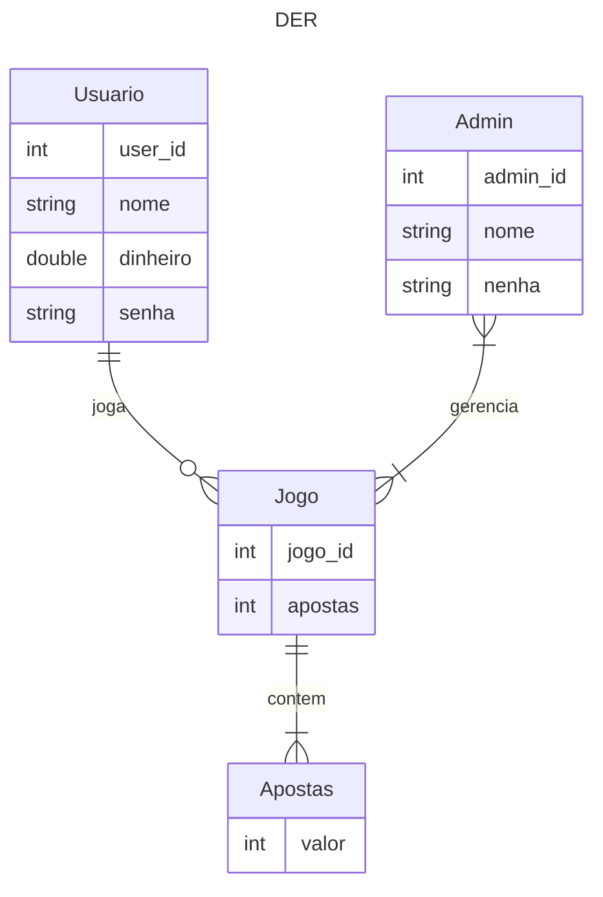

```mermaid
---
title: DER
---
erDiagram
    Usuario ||--o{ Jogo :  joga
    Admin |{--|{ Jogo :  gerencia
    Jogo ||--|{ Apostas: contem

  Usuario {
        int user_id
        string nome
        double dinheiro
        string senha
    }

      Admin {
        int admin_id
        string nome
        string nenha
    }

      Jogo {
        int jogo_id
        int apostas
    }

      Apostas {
        int valor   
    }
```